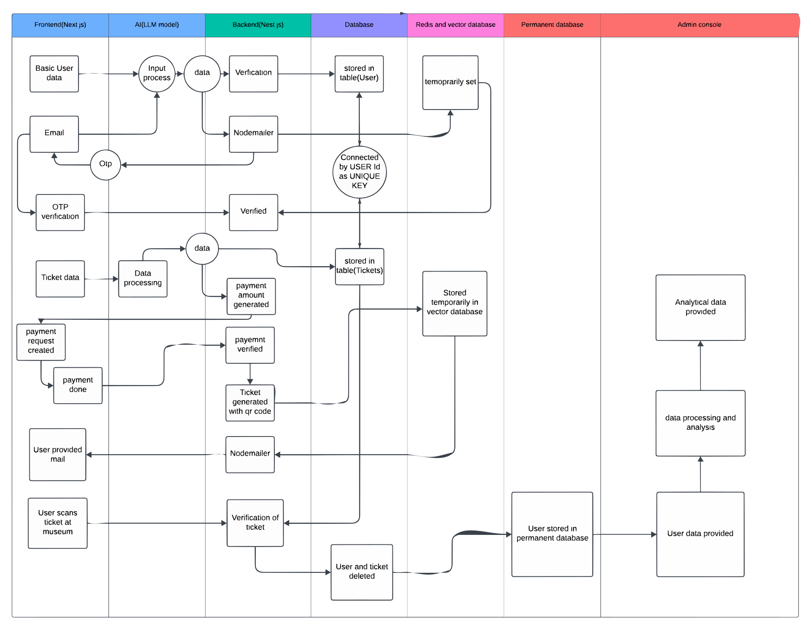
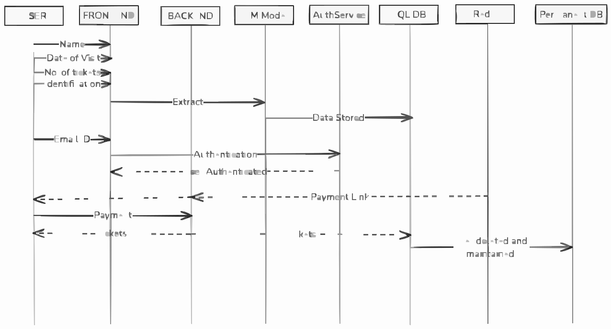

# TixBot

TixBot is an AI-powered chatbot designed to assist users in booking tickets for museums efficiently. Users can interact with the bot to choose their preferred date, time, and type of tickets. The bot handles payment, ticket generation, and sends tickets directly to users via email.

## Prerequisites

To run the project locally, ensure you have the following installed:
- npm (version X.X.X)
- Node.js (version X.X.X)
- Flutter (version X.X.X)
- Docker (optional for containerization)

## Tech Stack

- **Backend**: NestJS, Prisma, JWT authentication
- **Web**: Next.js
- **AI**: Python, LLM model
- **Ticket generation**: Python (SQLAlchemy, PIL, qrcode)
- **Database**: Docker (PostgreSQL, Redis)

## Packages

The project is organized into multiple packages:
- **chatbot**: Contains the Rasa/Dialogflow code and logic for TixBot.
- **flutter-app**: Contains the Flutter code for the mobile application.
- **server/backend**: Contains the backend API logic for ticket booking, user authentication, and payment.
- **server/ticketing**: Manages ticket generation, including PDF creation and QR code generation.
- **web-app**: Contains the web interface for booking and interacting with the bot.

## Installation

To install the project locally, visit our Installation Guide.

## Usage

For information on how to use TixBot, refer to our Usage Guide.

## Features

- **Chatbot Interaction**: Book tickets by chatting with TixBot.
- **Payment Integration**: Secure payments via Stripe and PayPal.
- **Ticket Generation**: Receive tickets with QR codes for easy entry.
- **Email Confirmation**: Tickets and booking details are emailed directly to the user.
- **Multilingual Support**: Chatbot supports multiple languages for global users.

## Contributing

We welcome contributions! To learn how to contribute to this project, please refer to our Contributing Guidelines.

## Coding Standards

We follow industry-standard coding practices, with a strong emphasis on test-driven development and clean, modular code. Please ensure that your contributions adhere to these guidelines.

## License

This project is licensed under a Custom License to prevent commercial use. For more details, see the LICENSE file in the GitHub repository.

## Contact

For any inquiries or further information, please contact us at:
Email: [contacttixbot@gmail.com](mailto:contacttixbot@gmail.com)

## Support

If you encounter any issues while using or contributing to the project, please create an issue in our GitHub Repository.

## Acknowledgments

We would like to extend our gratitude to all the contributors who helped develop this project. Special thanks to the chatbot and AI community for their valuable resources.

## Flow Diagrams

### System Flow Diagram

### Sequential Flow Diagram

